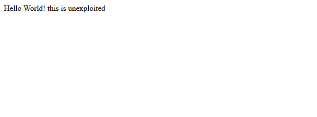
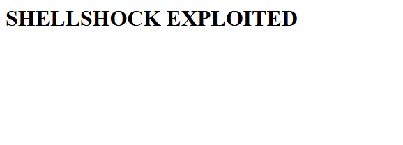

# Shellshock (CVE-2014-6271)

A simple exploit for **CVE-2014-6271 (Shellshock)**.

The exploit sends a specially crafted `User-Agent` header to the vulnerable CGI endpoint. The command in the header is then executed by the vulnerable version of Bash.

For this lab, the exploit changes the `index.html` page to show a message.

## Before



## Exploit

Run:

```bash
python exploit.py
```

The exploit sends a GET request to:

```text
/cgi-bin/end-point
```

with the Shellshock payload in the `User-Agent` header.

The payload changes the contents of:

```text
/var/www/html/index.html
```

## After



## Lab

This exploit is designed to be used with the vulnerable Docker lab.

[Shellshock Lab README](../../labs/Shellshock%28CVE-2014-6271%29/README.md)
